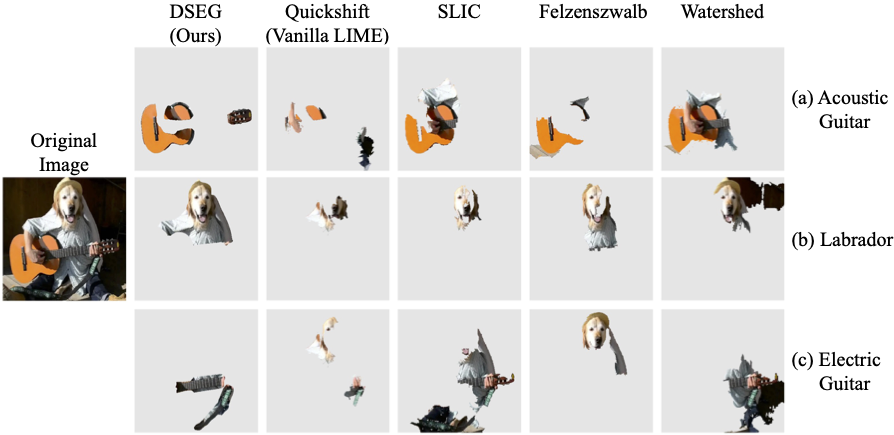

<a name="readme-top"></a>

<!-- PROJECT LOGO -->
<br />
<div align="center">

  <h1 align="center">Beyond Pixels: Enhancing LIME with Hierarchical Features and Segmentation Foundation Models</h1>

  <p align="center">
    Preprint
    
</div>



## Table of Contents

- [DSEG-LIME](#dseg-lime)
- [Quick Start](#quick-start)
- [Getting Started](#getting-started)
  - [Prerequisites](#prerequisites)
  - [Datasets](#datasets)
  - [Models](#models)
  - [Configuration](#config)
  - [Experiments & Evaluations](#experiments--evaluations)
- [Related Work](#related-work)


<!-- ABOUT THE PROJECT -->
## DSEG-LIME

***Abstract.*** Explainable Artificial Intelligence is critical in unraveling decision-making processes in complex machine learning models. LIME (Local Interpretable Model-agnostic Explanations) is a well-known XAI framework for image analysis. It utilizes image segmentation to create features to identify relevant areas for classification. Consequently, poor segmentation can compromise the consistency of the explanation and undermine the importance of the segments, affecting the overall interpretability. Addressing these challenges, we introduce **DSEG-LIME** (**D**ata-Driven **Seg**mentation **LIME**), featuring: ***i)*** a data-driven segmentation for human-recognized feature generation, and ***ii)*** a hierarchical segmentation procedure through composition. We benchmark DSEG-LIME on pre-trained models with images from the ImageNet dataset - scenarios without domain-specific knowledge. The analysis includes a quantitative evaluation using established XAI metrics, complemented by a qualitative assessment through a user study. Our findings demonstrate that DSEG outperforms in most of the XAI metrics and enhances the alignment of explanations with human-recognized concepts, significantly improving interpretability.

<p align="right">(<a href="#readme-top">🔝 back to top</a>)</p>

## Quick Start

For quick results using DSEG-LIME, you're encouraged to experiment with the provided notebook. This allows for a faster experience in obtaining outcomes:
- [DSEG-LIME Quick Start](DSEG_Demo.ipynb)

Be mindful of potential package-related issues, as it's crucial to have all necessary packages installed with their correct versions. For detailed information on the required packages and their specific versions, please refer to the [Prerequisites](#prerequisites) section. 

For detailed information and insights on each parameter, please refer to the [Parameter Description](Config.md) section.

<p align="right">(<a href="#readme-top">🔝 back to top</a>)</p>


<!-- GETTING STARTED -->
## Getting Started

You need an environment in anaconda with the correct packages to run the project on your own computer. 

### Prerequisites

Additional Python packages are required to execute the code. For this purpose, [requirements](requirements.txt) contains the package versions used in this project. The installation can be carried out as follows:

* pip
  ```sh
  pip install -r path/to/requirements.txt
  ```

We advice to install the packages in a new environemnt to mitigate the risk of facing issues with version conflicts of preinstalled packages. The environment we used in our study was based on Python 3.10.8 in a linux environment.

Once the necessary requirements are installed, you can execute the [DSEG-Demo](DSEG_Demo.ipynb) to explore the provided examples or to process your own images. Note that possessing the [SAM checkpoint](#models) and downloading the [model](#models) for explanation are prerequisites for operation.

<p align="right">(<a href="#readme-top">🔝 back to top</a>)</p>

### Datasets
The folder [Dataset](Dataset) is split into three parts. 
- The images treated in this paper for quantitative and qualitative evaluation are in [Evaluation](Dataset/Evaluation/). Some of them are from the repository of [ImageNet](https://github.com/EliSchwartz/imagenet-sample-images/blob/master/gallery.md). 

- In [Results](Dataset/Results/) are the experimental results that have been presented in our paper. Results is further split into the individual results by the covered models for explanation and the conducted user study with the according data.

- In [Test-Examples](Dataset/Test-Examples/) are three exemplarily examples for testing the LIME techniques. You can add and test your own images as well.

<p align="right">(<a href="#readme-top">🔝 back to top</a>)</p>

### Models
In this project, we utilize the following pretrained models:

Models for segmentation:
- [Segment Anything (SAM)](https://arxiv.org/abs/2304.02643) - Here [GIT](https://github.com/facebookresearch/segment-anything?tab=readme-ov-file#model-checkpoints), you can download the model checkpoint and insert it into the [Models/pretrained](Models/pretrained/) folder.
- [End-to-End Object Detection with Transformers (DETR)](https://arxiv.org/abs/2005.12872) - Here [GIT](https://github.com/facebookresearch/detr), you can find the implementation. The models gets automatically installed by Python when executing the code.


Models for Explanation:
- [EfficientNet (B4)](https://arxiv.org/abs/1905.11946) - Here [GIT](https://github.com/facebookresearch/segment-anything?tab=readme-ov-file#model-checkpoints), you can download the model checkpoint and insert it into the [Models](Models) folder.
- [ResNet (101)](https://arxiv.org/abs/1512.03385) - Here [GIT](https://pytorch.org/hub/pytorch_vision_resnet/), you can find the implementation. The models gets automatically installed by Python when executing the code.
- [VisionTransformer (384)](https://arxiv.org/abs/2010.11929) - Here [GIT](https://huggingface.co/google/vit-large-patch32-384), you can find the implementation. The models gets automatically installed by Python when executing the code.

**Important**: To enhance flexibility and enable the use of alternative models within your application, modifications are required in the utility code, particularly where the configuration validates the model's naming convention for application. It is possible that some alternative models may already be compatible with the existing implementations. In such cases, you must manually adjust the configuration to ensure the model is processed correctly by DSEG. To achieve this, carefully review the configuration documentation to understand how to specify the model parameters appropriately. We have incorporated explanatory comments at the necessary points within the code to facilitate better understanding and ease of use.

<p align="right">(<a href="#readme-top">🔝 back to top</a>)</p>

### Config

If you encounter any questions about the configuration detailed at the start of the notebooks, please refer to the explanations of specific parameters provided in [Config](Config.md). The parameters listed were used to conduct the experiments. Should you wish to utilize a different model, it's necessary to assign a new boolean value accordingly. Additionally, if you're integrating a new model, this is also the location where you can define its name.

```yaml
XAI_algorithm:
  DSEG: True
  LIME: True
  SLIME: True
  BayesLime: True
  GLIME: True

...
```

<p align="right">(<a href="#readme-top">🔝 back to top</a>)</p>

### Experiments & Evaluations

The experimentation scripts are located in the [Experiments](Experiments) folder, allowing you to explore each technique discussed in the paper. These scripts are organized by LIME techniques.

For evaluations, the relevant scripts are found in the [Evaluation_Quantitative](Evaluation_Quantitative) folder. Scripts prefixed with 04_ facilitate experimentation across all 20 images, while those starting with 05_ detail the experimental results featured in the paper. We had to add a script for the [computation time](Evaluation_Quantitative/05_Result_TIMES.ipynb) since the experiments were conducted on different servers, but the computation times were repeated on the same server instance to be able to compare the times.

The evaluation of the user study can be found in the notebook titled [User-Study-Evaluation](User-Study-Evaluation.ipynb).


## Related Work
- [LIME](https://github.com/marcotcr/lime) - [Paper](https://arxiv.org/abs/1602.04938)
- [SLIME](https://github.com/ZhengzeZhou/slime) - [Paper](https://arxiv.org/abs/2106.07875)
- [GLIME](https://github.com/thutzr/glime-general-stable-and-local-lime-explanation) - [Paper](https://openreview.net/forum?id=3FJaFElIVN&referrer=%5BAuthor%20Console%5D(%2Fgroup%3Fid%3DNeurIPS.cc%2F2023%2FConference%2FAuthors%23your-submissions))
- [BayLIME](https://github.com/x-y-zhao/BayLime/tree/master) - [Paper](https://arxiv.org/abs/2012.03058)

The other models used in this study are already listed in the section where we refer to their implementation.

<p align="right">(<a href="#readme-top">🔝 back to top</a>)</p>
